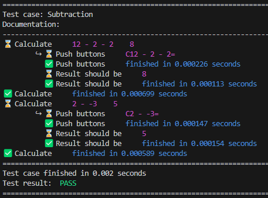

# robot-autologger
The Robot Autologger is a terminal logger for Robot Framework v7.0 or higher that uses the Listener interface. It can be used to automatically log Listener events and provide real time test execution reporting. By default, Robot Framework's native logging doesn't provide much information about test performance _while_ the text is executed. The Robot Autologger is here to enable real time reporting to Robot Framework users.

An example of the Robot Autologger output is:



The Autologger allows users to enable/disable keyword arguments and elapsed time information. These features are disabled by default.

# Usage

To add the Robot Autologger to your Robot Framework test suite execution, add the following arguments to the `robot` command:

```
robot --console quiet --listener /path/to/Listener.py:True:True
```

`--console quiet` since the `--listener` takes care of logging events from the test suite. 

# Arguments

For the Listener arguments, these are:
* `print_args`: Log the keyword arguments, replacing variables with their actual value when needed;
* `print_elapsed_time`: Log the elapsed time of keyword events. Test suites and test cases elapsed times are logged by default.

These are disabled by default.